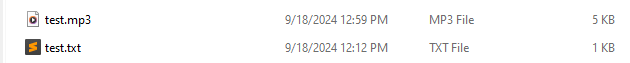

# Quick start guide

Follow this tutorial to learn how to use Write2Audiobook.

## Clone the repository

Clone the repository to your computer.

```bash
git clone https://github.com/deangelisdf/write2audiobook.git
```

## Create a virtual environment

To keep your workspace clean and to prevent conflicts with previously installed libraries, create a virtual environment.

NOTE:
If you're on a Linux system, you must install additional packages:<br>
    ```
    sudo apt update && sudo apt install espeak ffmpeg libespeak1 -y
    ```

## Convert a text-based file to an audiobook

To convert an EPUB file to an audiobook:

```bash
python3 ebook2audio.py book.epub
```

To convert a plain text file to an audiobook:

```bash
python3 txt2audio.py text.txt
```

To convert a PowerPoint presentation (PPTX) to an audiobook:

```bash
python3 pptx2audio.py presentation.pptx
```

To convert a Word document (DOCX) to an audiobook:

```bash
python3 docx2audio.py document.docx
```

## Enjoy your audiobook

Write2Audio saves your audiobook as an MP3 file in the current directory. It will have the same name as the converted file.

```bash
python3 txt2audio.py test.txt
```

