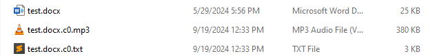

This page explains how to use the `docx2audio.py` script to convert Word documents to MP3 files.

!!! important
    Word documents you want to convert must meet these requirements:

    * The file extension must be **.docx**.

## Run the script

To convert a Word document to MP3 files:

1. [Download the script](./download-scripts.md) and [install the required libraries](./install-libraries.md).
1. In your terminal, go to the Write2Audiobook project's root directory.

    ```console
    cd write2audiobook
    ```

1. Run the `docx2audio.py` script.

    ```console
    python3 docx2audio.py path/to/file/test.docx
    ```

## View the output

The script creates MP3 files and plain text files as it converts the Word document. It may convert
larger documents into multiple MP3 files and text files.

For example, if the script creates *X* files:

- MP3 files will have a name like `\<original-file-name\>.docx.cX.mp3`.
- Text files will have a name like `\<original-file-name\>.docx.cX.txt`

Look for the MP3 files in the Word document's directory to confirm the conversion was successful.


