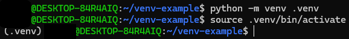

This page explains how to install the libraries and packages required to run the Write2Audiobook scripts.

## Prerequisites

All Write2Audiobook scripts are written in Python. If you don't already have Python installed on your computer, see the
[Python Beginner's Guide](https://wiki.python.org/moin/BeginnersGuide/Download) for instructions on downloading
and installing Python.

## Virtual environments

Virtual environments keep workspaces clean and avoid potential conflicts with previously
install libraries. This keeps your development environments isolated. If something happens to
a library in a virtual environment, you've contained the damage to that one folder.

### Create a virtual environment

Create a virtual environment for your Write2Audiobook project:

1. In your terminal, go to the Write2Audiobook project's root directory.

    ```console
    cd write2audiobook
    ```

1. Run the following command:

    ```console
    python3 -m venv .venv
    ```

    This creates a virtual environment in new folder called `.venv`.

### Activate a virtual environment

Run the following code to activate a virtual environment:

=== "Powershell"
    ```powershell
    .venv\Scripts\Activate.ps1
    ```

=== "Command Prompt"
    ```bat
    .venv\Scripts\activate.bat
    ```

=== "Linux or macOS"
    ```console
    source .venv/bin/activate
    ```

When your virtual environment is active, you'll see `(.venv)` in front of your terminal's prompt.



### Exit a virtual environment

After you have finished working in the Write2Audiobook project, exit the virtual environment with the following command:

```console
deactivate
```

## Install the required libraries

The Write2Audio project requires several Python libraries to run its scripts. The
[`requirements`](https://github.com/deangelisdf/write2audiobook/blob/main/requirements) file lists these libraries.

Install the libraries from the `requirements` file:

1. [Activate your virtual environment](#activate-a-virtual-environment).
1. Run the following command:

    ```console
    python3 -m pip install -r requirements
    ```

1. Confirm the installation succeeded by looking at the list of installed libraries.

    ```console
    python3 -m pip list
    ```

You'll get a confirmation message when the installation is complete.

!!! important
    If you're on a Linux system, you must install additional system packages. Install these packages with the following command:
    ```console
    sudo apt update && sudo apt install espeak ffmpeg libespeak1 -y
    ```
